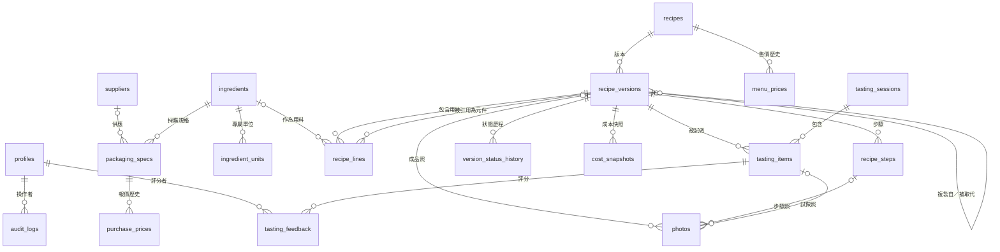
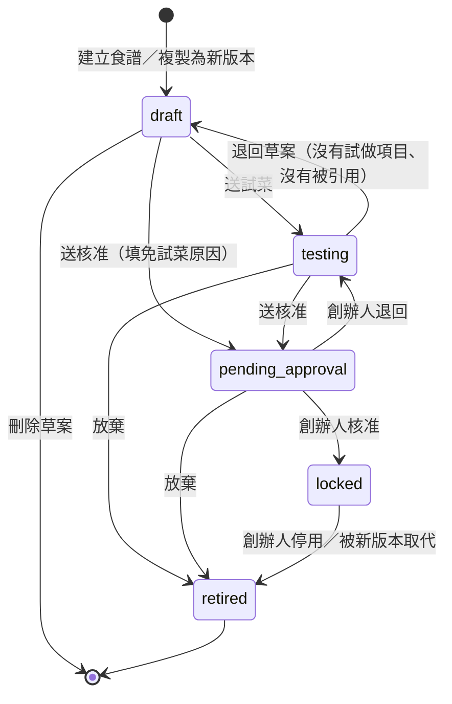
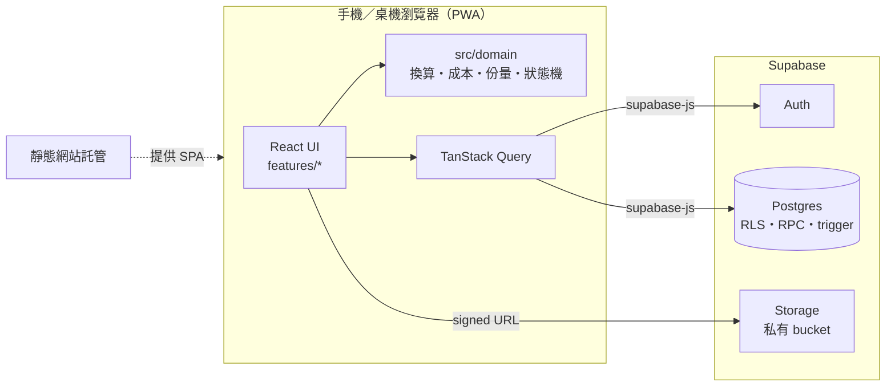

# 試菜與標準食譜系統 — 規格書

| 項目 | 內容 |
|---|---|
| 版本 | v1.0 |
| 日期 | 2026-09-16 |
| 狀態 | **已定案**：使用者回覆「照預設」，MVP 第一版已實作 |
| 開發規則 | [CLAUDE.md](../CLAUDE.md) |

---

## 實作調整紀錄（v1.0）

實作時和 v0.1 草案不同的地方如下；本文件其他段落若有衝突，以這一節和 CLAUDE.md 為準。

| # | 調整 | 原因 |
|---|---|---|
| 1 | 專案位置改為 `C:\Users\User\Desktop\麵店\recipe-system` | 使用者指定 |
| 2 | 品項以《餐廳菜單_完整試作與配方表》（2026/9/16 基準版）為準 | 使用者指定；由 `scripts/import_baseline.py` 轉檔匯入，真實資料只放 `private/` |
| 3 | 新增 `recipes.menu_category`（菜單分類） | 基準版菜單以分類組織 |
| 4 | 草案的用料用量可以留空（顯示「用量待填」），送試菜前必須填齊 | 基準版多數克重尚未決定，試菜期需要先列出用料 |
| 5 | 資料表放在不公開的 `app` schema，前端只能呼叫 `public` RPC（取代「每張表寫 RLS policy」） | 權限集中在 RPC 檢查，測試與稽核更單純 |
| 6 | 資料庫測試改用 PGlite + Vitest（取代 pgTAP） | 本機沒有 Docker；同一套 migrations 也能在瀏覽器內跑成示範模式 |
| 7 | 新增「示範模式」：沒有設定 Supabase 時，瀏覽器內用 PGlite 執行完整系統 | 還沒建立 Supabase 帳號前就能試用與驗收 |
| 8 | Supabase 免費方案可建 2 個專案、訓練紀錄已用 1 個，因此只建 1 個正式專案；開發與測試改用本機 PGlite | 取代 §5.5 的 dev／prod 兩個專案 |
| 9 | UI 元件自行撰寫（未使用 shadcn/ui、React Hook Form、vite-plugin-pwa） | 減少相依套件；PWA 安裝功能延後 |
| 10 | 路由使用 HashRouter | Cloudflare Pages 或 GitHub Pages 都不需要設定網址改寫 |
| 11 | 步驟照片要先儲存草案才能上傳 | 照片要掛在已存在的步驟上 |
| 12 | 部署改為 GitHub Pages，原始碼公開（取代 §5.5 建議的 Cloudflare Pages） | 使用者選擇；真實菜單只放本機 `private/`，資料在 Supabase，受資料庫權限保護 |
| 13 | 創辦人帳號在部署前由 Supabase 後台建立 | 「第一個註冊者成為創辦人」在公開網址上有被搶先註冊的風險 |
| 14 | 產量與每份量改成送試菜時不必填、送核准前才要求；「試菜中」可用 `record_yield` 記錄實際產量（其他內容仍凍結） | 產量是試做後秤出來的結果，事前要求等於逼使用者先猜一個數字；凍結後又填不進去 |
| 15 | 試菜場次可以事後加入項目、修改指派、移除沒有評分的項目 | 建立場次時常常還沒決定要試哪些 |
| 16 | 新增「籌備進度」頁：依分類看開發進度、列出卡關項目、彙整菜品成本 | 籌備期需要一眼看出還差多少、卡在哪裡；資料都來自既有 RPC，沒有新增資料表 |
| 17 | 試菜場次可記錄當天的會議總結，每個試做項目可記錄結論與決議（進入下一輪／需要調整／淘汰／可以定版） | 試菜後開會的共識原本只留在紙本，隔週就對不起來 |
| 18 | 試菜場次裡已停用的項目排到最下方並淡化顯示 | 停用的版本要留著備查，但不該擋在還在試的項目前面 |

## 原「待確認事項」（已依預設值定案）

| # | 問題 | 定案 |
|---|---|---|
| 1 | **誰可以核准定版？** | 只有創辦人可以。主廚可以送核准，但不能核准。 |
| 2 | **測試人員是內部員工，還是外部親友？** | 當成外部人員處理：只看得到被指派的試做項目（名稱或盲測代號、照片），看不到用料數量、步驟與成本，也看不到別人的評分。 |
| 3 | **售價與稅務口徑** | 菜單售價含 5% 營業稅，毛利以未稅售價計算；原物料單價輸入實際支付金額。若店家是小規模營業人或可扣抵進項稅，請先和會計確認口徑。 |
| 4 | **部署與前端技術** | 改用 React + TypeScript（訓練紀錄用的是純 JS）。部署建議用私有 repo + Cloudflare Pages；如果不想多開帳號，就改用 GitHub Pages，但 repo 必須公開（程式碼會公開，資料不會）。 |
| 5 | **目前有沒有 Excel 成本表或食譜？** | 如果有，會拿 2–3 份來做「黃金範例」驗證計算，並評估是否要把 CSV 匯入提前到 MVP；如果沒有，就用本文件 §3.4 的虛構範例。 |
| 6 | **專案資料夾位置** | `C:\Users\User\Desktop\麵店\recipe-system`（使用者指定） |

其他預設假設也一併採用：店長可以維護原物料單價；目標食材成本率 35%；建議售價進位到 5 元；評分使用 1–5 分。

---

## 1. MVP 功能範圍與不做事項

### 1.1 上線時要達成

1. 開店前，所有菜品、湯底、醬料、配料都有已定版版本，也印得出標準卡。
2. 任何一道菜品，1 分鐘內查得到每份成本、食材成本率與建議售價。
3. 任何一個定版內容，都能追溯到它是從哪個版本修改而來、試菜分數、問題與核准人。

### 1.2 MVP 必做

| 模組 | 功能 |
|---|---|
| 帳號與角色 | Email 註冊後進入「待審核」；創辦人指派角色或停用帳號 |
| 原物料 | 新增、編輯、搜尋；分類；基本單位（g／ml／個）；預設損耗率；密度；專屬單位（例如 1 顆 = 60 g）；編輯食譜時可以**就地快速新增**；查看「用到此原物料的食譜」 |
| 供應商 | 新增、編輯、搜尋；聯絡人、電話、備註 |
| 包裝規格與單價 | 一個原物料可以有多個採購規格（可指定供應商），其中一個是預設規格；報價歷史（有生效日，只增不改，打錯可作廢）；價格更新後列出受影響的菜品與新的食材成本率 |
| 菜品與元件 | 新增、編輯、搜尋（名稱、編號、使用的原物料）；元件分類（湯底、醬料、配料、麵條、其他）；封存 |
| 食譜版本 | 草案編輯（用料分組，例如「爆香料」「A 料」）；引用元件（綁定版本）；步驟（時間、溫度、火力、關鍵管制點、照片）；批次產量；每份量；出成率；保存方式與期限；複製為新版本；兩個版本比較；狀態流轉與核准 |
| 試菜 | 試菜場次；試做項目（試做人、實際做法偏差、照片、盲測代號）；個人評分（整體、風味、口感、香氣、外觀、鹹淡、油膩度、問題、修改建議、能不能上菜單）；平均分數；依回饋一鍵建立新版本 |
| 成本 | 每行成本、批次成本、每份成本、出成率、食材成本率、食材毛利率、建議售價；成本不完整時警示；定版時存成本快照；售價歷史 |
| 份量換算與標準卡 | 一份、十份、一批次、自訂份數或產量；手機檢視；A4／A5 列印版面；非定版加浮水印；預設不含成本 |
| 操作紀錄 | 所有業務資料的新增、修改、刪除與狀態變更自動記錄；可依對象、人員、日期查詢；各詳情頁都有「紀錄」分頁 |
| 首頁待辦 | 待我核准、待我評分、缺價格的原物料、引用過時元件版本的菜品、超過目標成本率的菜品 |
| 系統設定 | 目標食材成本率、營業稅率、建議售價進位單位、送核准前是否需要試菜紀錄 |
| 資料匯出 | 創辦人可以匯出全部資料 JSON（備份用） |

### 1.3 MVP 不做

| 項目 | 說明／替代做法 |
|---|---|
| POS 串接 | 使用者指定不做 |
| 供應商下單、請購、驗收、應付帳款 | 使用者指定不做；只記錄單價 |
| 排班、薪資、會計 | 使用者指定不做 |
| 外送平台整合 | 使用者指定不做 |
| 庫存、盤點、進銷存 | 屬於營運階段的需求 |
| 人工、瓦斯水電、租金分攤 | 毛利只計算「食材毛利」，畫面上會標示清楚 |
| 內用與外帶兩套成本 | 外帶包材可以先建成原物料，另外做一個外帶用的菜品；Phase 2 再做成正式功能 |
| 營養成分、過敏原自動計算 | 需要營養資料庫 |
| 多門市、多品牌、中央廚房配送 | 目前只有單一籌備團隊 |
| 離線編輯與離線瀏覽 | MVP 需要連網；內場用列印出來的標準卡當離線備援 |
| 多層簽核、會簽 | 只有單一核准人 |
| 多人即時協同編輯 | 用樂觀鎖防止互相覆蓋 |
| Excel、CSV 匯入，報價單或發票 OCR | 視待確認事項第 5 點決定 |
| 原生 App、推播、LINE 通知 | 用 PWA 加到手機主畫面 |
| 價格趨勢圖、菜單工程分析 | 資料會保留，Phase 2 再做報表 |
| 多語系、製程影片 | 只做繁體中文與照片 |

---

## 2. 使用者角色與權限

### 2.1 角色定義

| 角色 | 代碼 | 典型人員 | 主要任務 |
|---|---|---|---|
| 創辦人 | `founder` | 老闆、合夥人（可以有多位） | 核准定版、決定售價、管理帳號與設定、查看全部操作紀錄 |
| 研發／主廚 | `chef` | 主廚、研發人員 | 建立食譜、迭代版本、主持試菜、維護原物料 |
| 店長 | `manager` | 店長、內場主管 | 查看食譜與成本、維護價格、記錄試做、使用標準卡 |
| 測試人員 | `tester` | 試吃員、親友 | 針對被指派的試做項目評分 |
| 待審核 | `pending` | 剛註冊的帳號 | 沒有任何權限 |

### 2.2 權限矩陣

✅ 可以　👁 唯讀　🔸 有條件　— 不可

| 功能 | 創辦人 | 主廚 | 店長 | 測試人員 |
|---|:-:|:-:|:-:|:-:|
| 帳號審核、指派角色、停用帳號 | ✅ | — | — | — |
| 系統設定 | ✅ | 👁 | — | — |
| 原物料、單位換算、損耗率 | ✅ | ✅ | ✅ | — |
| 供應商、包裝規格 | ✅ | ✅ | ✅ | — |
| 新增單價 | ✅ | ✅ | ✅ | — |
| 作廢單價 | ✅ | — | — | — |
| 查看單價、成本、毛利 | ✅ | ✅ | 👁 | — |
| 建立菜品或元件、編輯主檔、封存 | ✅ | ✅ | — | — |
| 查看完整食譜（用料、步驟） | ✅ | ✅ | 👁 | — |
| 建立版本、編輯草案、複製為新版本、刪除草案 | ✅ | ✅ | — | — |
| 送試菜、送核准、退回草案 | ✅ | ✅ | — | — |
| **核准定版、退回試菜** | ✅ | — | — | — |
| 停用試菜中或待核准的版本 | ✅ | ✅ | — | — |
| 停用已定版的版本 | ✅ | — | — | — |
| 設定售價 | ✅ | — | — | — |
| 建立試菜場次與試做項目、上傳試做照片 | ✅ | ✅ | ✅ | — |
| 填寫試吃評分 | ✅ | ✅ | ✅ | 🔸 只限被指派的項目 |
| 修改評分 | 🔸 自己的 | 🔸 自己的 | 🔸 自己的 | 🔸 自己的 |
| 查看所有人的評分 | ✅ | ✅ | ✅ | — 只看自己的 |
| 查看、列印已定版標準卡 | ✅ | ✅ | ✅ | — |
| 列印含成本版標準卡 | ✅ | — | — | — |
| 列印非定版標準卡（有浮水印） | ✅ | ✅ | — | — |
| 查看操作紀錄 | ✅ 全部 | 🔸 食譜與原物料 | — | — |
| 匯出全部資料 | ✅ | — | — | — |

### 2.3 權限實作原則

1. **權限一律在資料庫層執行。** 每張表都啟用 RLS，用 `auth_role()` helper 讀取 `profiles.role`。
2. 需要跨表檢查的動作（狀態轉移、複製版本、儲存草案、指派角色、設定售價），一律透過 `security definer` RPC，並在函式裡重新驗證角色與前置條件。
3. RLS 只能控制到「列」，控制不到「欄」，所以敏感資料要**拆表**：單價在 `purchase_prices`，用料在 `recipe_lines`。測試人員根本讀不到這些表；測試人員要看的內容由 RPC `get_my_tasting_tasks()` 回傳（只有名稱或盲測代號、照片、自己的評分）。
4. Storage bucket 設成私有，用 signed URL 讀取，storage policy 和資料表權限保持一致。
5. 開放 Email 註冊，但新帳號角色是 `pending`，讀不到任何業務資料，所以不需要 service role key 或 Edge Function。

---

## 3. 資料庫 ERD

### 3.1 關聯圖



`units`（全域單位）與 `app_settings` 是獨立的參照表，不和其他表建立外鍵。用料的單位欄位存「全域單位代碼」或「原物料專屬單位名稱」，由 `src/domain` 解析。

所有業務表都有 `created_at`、`updated_at`、`created_by`，下面不再重複列出。

### 3.2 資料表

#### 帳號與設定

**profiles**：使用者
| 欄位 | 型別 | 說明 |
|---|---|---|
| id | uuid PK, FK auth.users | |
| display_name | text | 顯示名稱 |
| role | text | `founder` `chef` `manager` `tester` `pending` |
| is_active | bool | 停用的帳號不能登入 |

**app_settings**：系統設定
| 欄位 | 型別 | 說明 |
|---|---|---|
| key | text PK | `target_food_cost_rate`＝0.35、`sales_tax_rate`＝0.05、`price_round_to`＝5、`require_tasting_before_approval`＝true |
| value | jsonb | |

#### 原物料與價格

**units**：全域單位（系統內建）
| 欄位 | 型別 | 說明 |
|---|---|---|
| code | text PK | `g` `kg` `台斤` `兩` `ml` `L` `大匙` `小匙` `pc` |
| name_zh | text | 公克、公斤、台斤…… |
| dimension | text | `mass` `volume` `count` |
| factor_to_base | numeric | 換算成 g、ml 或 pc 的倍數 |

**ingredients**：原物料
| 欄位 | 型別 | 說明 |
|---|---|---|
| id | uuid PK | |
| code | text unique | `I-0001` |
| name | text unique | |
| category | text | `meat` `seafood` `produce` `dry_goods` `seasoning` `oil` `grain` `egg_soy_dairy` `packaging` `other` |
| base_dimension | text | `mass`→g、`volume`→ml、`count`→pc |
| default_waste_rate | numeric(5,4) | 0 ≤ r < 1 |
| density_g_per_ml | numeric null | 質量和體積互換時使用 |
| note, is_active | | |

**ingredient_units**：原物料專屬單位
| 欄位 | 型別 | 說明 |
|---|---|---|
| id | uuid PK | |
| ingredient_id | FK | |
| unit_name | text | 顆、把、瓣、盒；和 ingredient_id 組成 unique |
| qty_in_base | numeric > 0 | 例如 1 顆 = 60（g） |

**suppliers**：供應商
| 欄位 | 型別 | 說明 |
|---|---|---|
| id | uuid PK | |
| name | text unique | |
| contact_name, phone, note, is_active | | |

**packaging_specs**：包裝規格
| 欄位 | 型別 | 說明 |
|---|---|---|
| id | uuid PK | |
| ingredient_id | FK | |
| supplier_id | FK null | 市場現買可以留空 |
| spec_name | text | 「20 kg/箱」 |
| pack_qty | numeric > 0 | 20 |
| pack_unit | text | 全域單位代碼或專屬單位名稱 |
| is_default | bool | 每個原物料只能有一筆 true（partial unique） |
| is_active, note | | |

**purchase_prices**：單價（只增不改）
| 欄位 | 型別 | 說明 |
|---|---|---|
| id | uuid PK | |
| packaging_spec_id | FK | |
| price | numeric(12,2) ≥ 0 | 實際支付金額 |
| effective_date | date | 生效日 |
| is_void, void_reason | | 只有創辦人可以作廢 |
| note | text | |

#### 食譜

**recipes**：菜品／元件主檔（不做版本控制，但會記操作紀錄）
| 欄位 | 型別 | 說明 |
|---|---|---|
| id | uuid PK | |
| code | text unique | 菜品 `D-001`、元件 `C-001` |
| type | text | `dish` `component` |
| component_kind | text null | `soup` `sauce` `topping` `noodle` `other`；type=component 時必填 |
| name | text | 和 type 組成 unique |
| description | text | |
| target_food_cost_rate | numeric null | 只限菜品；留空時使用系統設定 |
| is_archived | bool | |

**menu_prices**：售價歷史（只限菜品）
| 欄位 | 型別 | 說明 |
|---|---|---|
| id | uuid PK | |
| recipe_id | FK | |
| price | numeric(10,0) | 含稅售價 |
| effective_date | date | |
| note | text | |

**recipe_versions**：食譜版本
| 欄位 | 型別 | 說明 |
|---|---|---|
| id | uuid PK | |
| recipe_id | FK | |
| version_no | int | 和 recipe_id 組成 unique，遞增、不回收 |
| title | text | 簡短描述，例如「減鹽、大骨增量」 |
| status | text | `draft` `testing` `pending_approval` `locked` `retired` |
| based_on_version_id | FK self null | 複製來源 |
| change_note | text | 修改說明 |
| batch_output_qty / batch_output_unit | numeric / text | 批次產量（g 或 ml）；菜品等於每份克重 |
| serving_qty / serving_unit | numeric / text | 每份量或每份克重 |
| output_density_g_per_ml | numeric null | 產量用 ml 時用來計算出成率 |
| prep_minutes, cook_minutes | numeric null | |
| storage_method | text | 例如「冷藏 0–5°C，密封」 |
| shelf_life_hours | int null | |
| revision | int | 樂觀鎖，每次儲存 +1 |
| submitted_by/at, approved_by/at, retired_by/at, retire_reason | | |
| superseded_by_version_id | FK self null | 被哪個版本取代 |

約束：`unique (recipe_id) where status = 'locked'`

**recipe_lines**：用料（凍結）
| 欄位 | 型別 | 說明 |
|---|---|---|
| id | uuid PK | |
| version_id | FK | |
| sort_order | int | |
| group_label | text null | 「爆香料」「A 料」 |
| line_kind | text | `ingredient` `component` |
| ingredient_id | FK null | |
| component_version_id | FK recipe_versions null | 綁定元件版本 |
| quantity | numeric > 0 | **淨重** |
| unit | text | |
| waste_rate_override | numeric null | 0 ≤ r < 1 |
| prep_note | text | 「切段 3 cm」 |

約束：`ingredient_id` 和 `component_version_id` 只能有一個有值；被引用的版本狀態必須是 `testing`、`pending_approval` 或 `locked`，而且它所屬的食譜類型必須是 component，也不能是自己的食譜。

**recipe_steps**：步驟（凍結）
| 欄位 | 型別 | 說明 |
|---|---|---|
| id | uuid PK | |
| version_id | FK | |
| step_no | int | |
| instruction | text | |
| duration_minutes | numeric null | |
| temperature_c | numeric null | |
| heat_level | text null | `high` `medium` `low` `simmer` |
| is_critical | bool | 關鍵管制點 |
| critical_note | text null | 例如「中心溫度 ≥ 75°C」 |

**photos**：照片
| 欄位 | 型別 | 說明 |
|---|---|---|
| id | uuid PK | |
| storage_path | text unique | `versions/{id}/{uuid}.webp` |
| version_id / step_id / tasting_item_id | FK null | 三個欄位只能有一個有值 |
| caption | text | |
| sort_order | int | |

版本照片與步驟照片會跟著版本凍結；試做照片不凍結。

**version_status_history**：狀態歷程
| 欄位 | 型別 | 說明 |
|---|---|---|
| id | uuid PK | |
| version_id | FK | |
| from_status, to_status | text | |
| actor_id | FK profiles null | 系統自動轉移時為 null |
| comment | text | 送審說明、退回原因、核准意見、停用原因 |

**cost_snapshots**：成本快照
| 欄位 | 型別 | 說明 |
|---|---|---|
| id | uuid PK | |
| version_id | FK | |
| reason | text | `lock` `manual` |
| price_as_of | date | 計算時使用的價格日期 |
| batch_cost, cost_per_serving | numeric | 不進位 |
| yield_rate | numeric null | |
| menu_price, food_cost_rate | numeric null | |
| is_complete | bool | |
| detail | jsonb | 逐行記錄數量、單位成本、損耗率、行成本，以及使用的 `purchase_price_id` 或 `component_version_id` |

#### 試菜

**tasting_sessions**：試菜場次
| 欄位 | 型別 | 說明 |
|---|---|---|
| id | uuid PK | |
| tasted_on | date | 試菜日期 |
| title | text | 「9/20 湯底第二輪」 |
| location, note | text | |

**tasting_items**：試做項目
| 欄位 | 型別 | 說明 |
|---|---|---|
| id | uuid PK | |
| session_id | FK | |
| version_id | FK | 狀態必須是 `testing`、`pending_approval` 或 `locked` |
| maker_id | FK profiles null | 試做人 |
| maker_name | text null | 試做人沒有帳號時填這欄 |
| blind_label | text null | 有填時，測試人員只看得到這個代號（例如 A、B） |
| deviation_note | text | 實際做法和食譜的差異 |
| assigned_tester_ids | uuid[] | 被指派的測試人員 |

約束：`unique (session_id, version_id)`

**tasting_feedback**：試吃評分
| 欄位 | 型別 | 說明 |
|---|---|---|
| id | uuid PK | |
| tasting_item_id | FK | |
| taster_id | FK profiles null | |
| taster_name | text null | 外部試吃者，由別人代填 |
| entered_by | FK profiles | |
| score_overall | int 1–5 | 必填 |
| score_flavor, score_texture, score_aroma, score_appearance | int 1–5 null | |
| saltiness, oiliness | int −2…+2 null | 偏淡 ↔ 偏鹹、清爽 ↔ 油膩 |
| issues | text | 問題 |
| suggestions | text | 修改建議 |
| menu_ready | text null | `yes` `maybe` `no` |

約束：`unique (tasting_item_id, taster_id) where taster_id is not null`

#### 稽核

**audit_logs**：操作紀錄（只能新增）
| 欄位 | 型別 | 說明 |
|---|---|---|
| id | bigint identity PK | |
| occurred_at | timestamptz | |
| actor_id | uuid null | |
| action | text | `insert` `update` `delete` |
| table_name | text | |
| record_id | uuid | |
| old_data, new_data | jsonb | |
| changed_fields | text[] | |
| context | text null | 呼叫的 RPC 名稱，例如 `transition_version` |

### 3.3 版本狀態機



每個轉移由誰執行、前置條件與必填欄位，請見 [CLAUDE.md §4](../CLAUDE.md)。

### 3.4 計算公式與黃金範例（虛構資料）

公式請見 CLAUDE.md §3。以下範例會成為第一組黃金測試。

**原物料單位成本**

| 原物料 | 預設規格 | 單價 | 基本單位成本 | 損耗率 |
|---|---|---|---|---|
| 豬大骨 | 20 kg/箱 | 1,200 | 0.06 元/g | 0% |
| 洋蔥 | 20 kg/袋 | 500 | 0.025 元/g | 10% |
| 水 | 1 度（1,000 L） | 12 | 0.000012 元/ml | 0% |
| 生麵條 | 3 kg/箱 | 180 | 0.06 元/g | 0% |
| 青蔥 | 3 kg/箱 | 270 | 0.09 元/g | 20% |
| 雞蛋（1 顆 = 60 g） | 1 台斤 | 40 | 0.066667 元/g | 0% |

**元件：招牌湯底 v1（1 批次）**

| 用料 | 淨重 | 採購量 | 行成本 |
|---|---|---|---|
| 豬大骨 | 10,000 g | 10,000 g | 600.0000 |
| 洋蔥 | 2,000 g | 2,222.22 g | 55.5556 |
| 水 | 30 L（密度 1.0 → 30,000 g） | 30,000 ml | 0.3600 |
| **合計** | 投入淨重 42,000 g | | **655.9156** |

- 批次產量 21,000 g → 出成率 **50.0%**
- 每份 420 g → 一批 50 份，每份成本 = 655.9156 ÷ 21,000 × 420 = **13.1 元**

**菜品：招牌湯麵 v1（1 份）**

| 用料 | 用量 | 行成本 |
|---|---|---|
| 招牌湯底 v1 | 420 g | 13.1183 |
| 生麵條 | 150 g | 9.0000 |
| 青蔥 | 10 g（採購量 12.5 g） | 1.1250 |
| 雞蛋 | 1 顆（60 g） | 4.0000 |
| **每份成本** | | **27.2433 → 顯示 27.2 元** |

- 售價含稅 90 元 → 未稅 85.7143 元 → 食材成本率 **31.8%**、食材毛利率 **68.2%**
- 目標 35% → 27.2433 ÷ 0.35 × 1.05 = 81.73 → 進位到 5 元的倍數 → 建議售價 **85 元**
- 10 份：湯底 4,200 g、麵 1,500 g、蔥 100 g、蛋 10 顆
- 湯底自訂產量 30,000 g：倍率 1.428571 → 豬大骨 14,286 g、洋蔥 2,857 g、水 42,857 ml

### 3.5 資料庫層強制機制

| 機制 | 作用 |
|---|---|
| `guard_version_frozen()` trigger | 版本不是 draft 時，拒絕 `recipe_lines`、`recipe_steps`、版本或步驟照片的新增、修改、刪除，也拒絕修改 `recipe_versions` 的內容欄位 |
| `guard_version_delete()` trigger | 只允許刪除 draft |
| `audit.log_change()` trigger | 掛在所有業務表上 |
| partial unique index | 每個食譜最多一個 locked 版本；每個原物料最多一個預設規格 |
| check constraints | 損耗率範圍、數量 > 0、評分範圍、用料的兩個 FK 只能擇一 |
| RPC `create_recipe` | 建立主檔，同時建立 v1 草案 |
| RPC `save_version_draft(version_id, revision, payload)` | 用一個交易存完整份草案，並檢查樂觀鎖 |
| RPC `copy_version(source_id, change_note)` | 深層複製用料、步驟、版本照片（複製照片紀錄，檔案共用），不複製試菜紀錄 |
| RPC `transition_version(version_id, to_status, comment, snapshot)` | 驗證角色與前置條件，寫入歷程；定版時寫入快照並自動停用舊的定版 |
| RPC `set_menu_price`、`assign_role`、`get_my_tasting_tasks` | 見 §2.3 |

---

## 4. 頁面架構與主要操作流程

### 4.1 導覽

手機使用底部分頁列；桌機改成左側欄。

| 分頁 | 創辦人 | 主廚 | 店長 | 測試人員 |
|---|:-:|:-:|:-:|:-:|
| 首頁（待辦） | ✅ | ✅ | ✅ | ✅（待評分） |
| 食譜 | ✅ | ✅ | ✅ | — |
| 試菜 | ✅ | ✅ | ✅ | ✅（只有被指派的項目） |
| 原物料 | ✅ | ✅ | ✅ | — |
| 更多 | ✅ | ✅ | ✅ | ✅（帳號、登出） |

### 4.2 頁面清單

| 路由 | 頁面 | 主要內容 |
|---|---|---|
| `/login` | 登入／註冊 | |
| `/pending` | 等待審核 | 提示「請聯絡創辦人開通」 |
| `/` | 首頁 | 依角色顯示待辦卡片：待核准、待評分、缺價格、元件已過時、超過目標成本率、最近更新 |
| `/recipes` | 食譜列表 | 菜品／元件切換；元件分類、狀態篩選；搜尋名稱、編號、原物料；卡片顯示現行版本、狀態、每份成本、食材成本率 |
| `/recipes/new` | 新增菜品或元件 | 選類型 → 名稱 → 自動建立 v1 草案並進入編輯 |
| `/recipes/:id` | 食譜總覽 | 現行定版、版本時間軸（狀態標籤）、售價歷史、被哪些菜品引用（元件）、主檔編輯 |
| `/versions/:id` | 版本詳情 | 分頁：**用料**、**步驟**、**成本**、**試菜**、**紀錄**；底部固定列放該角色可用的狀態動作 |
| `/versions/:id/edit` | 草案編輯 | 用料編輯器（搜尋原物料或元件、快速新增、數量、單位、損耗、分組、處理方式）、產量與每份量、步驟編輯器、照片 |
| `/versions/:id/card` | 標準卡 | 份量切換（1／10／批次／自訂）；列印 A4／A5；非定版浮水印；創辦人可切換含成本 |
| `/compare?a=&b=` | 版本比較 | 用料增、刪、改（數量差與百分比）；步驟差異；成本、出成率、食材成本率；平均評分、鹹淡與油膩度平均 |
| `/tastings` | 試菜場次列表 | 依日期排列 |
| `/tastings/new` | 建立場次 | 日期、標題、選擇要試做的版本、盲測代號、指派測試人員 |
| `/tastings/:id` | 場次詳情 | 各試做項目並排，顯示平均分數 |
| `/tasting-items/:id` | 試做項目 | 照片、試做人、偏差說明、所有評分；「依回饋建立新版本」 |
| `/tasting-items/:id/feedback` | 我的評分 | 大按鈕 1–5 分、鹹淡與油膩度滑桿、問題、建議、能不能上菜單 |
| `/ingredients` | 原物料列表 | 分類篩選、搜尋、缺價格標示 |
| `/ingredients/:id` | 原物料詳情 | 基本資料、專屬單位、包裝規格與報價歷史、新增報價、用到此原物料的食譜、價格影響試算 |
| `/suppliers`、`/suppliers/:id` | 供應商 | 基本資料、供應的包裝規格 |
| `/more` | 更多 | 帳號、登出，以及依角色顯示以下管理頁 |
| `/admin/users` | 帳號管理 | 待審核清單、指派角色、停用 |
| `/admin/settings` | 系統設定 | |
| `/audit` | 操作紀錄 | 依資料類型、人員、日期篩選；逐欄位顯示差異 |
| `/admin/export` | 資料匯出 | |

### 4.3 主要操作流程

**A. 新菜品從草案到試菜**
1. 主廚：食譜 → ＋ 新增 → 選「菜品」→ 輸入名稱 → 系統建立 v1 草案，進入編輯。
2. 加用料：搜尋原物料；找不到就就地「快速新增」（名稱、基本單位，價格之後再補，成本會先顯示「缺價格」）。要引用湯底時，只能選已凍結的版本。
3. 填每份克重、步驟（時間、溫度、火力、關鍵管制點）、照片 → 儲存。
4. 送試菜 → 版本凍結。

**B. 試菜與迭代**
1. 主廚或店長：試菜 → 建立場次 → 選要比較的版本（例如湯底 v2、v3）→ 設定盲測代號 A／B → 指派測試人員。
2. 試做人上傳成品照，記錄實際做法偏差。
3. 測試人員用手機從首頁「待評分」進入 → 評分 → 送出（看不到別人的分數）。
4. 主廚在場次詳情看平均分數與問題 →「版本比較」→ 依回饋建立新版本（從選定版本複製成 v4 草案，並帶入回饋連結）→ 回到流程 A 第 2 步。

**C. 核准定版**
1. 主廚：版本詳情 → 送核准（填送審說明；系統檢查成本是否完整、元件是否已定版）。
2. 創辦人：首頁「待核准」→ 版本詳情，查看成本、食材成本率、試菜平均分數、與前一版的差異 → **核准**或**退回**（退回要填原因）。
3. 核准後：狀態改成已定版、寫入成本快照、同一食譜舊的定版自動停用；引用舊元件版本的菜品出現在首頁提醒。

**D. 修改已經定版的食譜**
1. 已定版的頁面沒有「編輯」按鈕，只有「複製為新版本」。
2. 新版本是草案，走流程 A 到 C。只改錯字時，可以直接送核准並填寫免試菜原因。

**E. 原物料價格更新**
1. 店長：原物料 → 選包裝規格 → 新增報價（生效日、金額）。
2. 系統列出受影響的菜品，以及新的每份成本與食材成本率；超過目標成本率的菜品會出現在首頁提醒。
3. 已定版版本的成本快照不會變；成本頁會同時顯示「現行價格成本」和「定版時成本」。

**F. 內場使用標準卡**
1. 店長或內場人員：食譜 → 招牌湯底 → 現行定版 → 標準卡。
2. 選「1 批次」或自訂產量 → 手機直接看，或列印成 A5 貼在內場。

### 4.4 標準卡內容

- 名稱、類型、版本號、**定版日期、核准人**；非定版加上斜向浮水印「非定版，不可用於出餐」
- 份量：1 份／10 份／1 批次／自訂，並顯示換算倍率
- 用料表：依分組排列；數量依規則進位；處理方式
- 步驟：編號、說明、時間、溫度、火力；關鍵管制點醒目標示
- 批次產量、每份量、出成率、保存方式與期限
- 成品照 1 張
- 頁尾：「時間與溫度不隨份量調整」、列印時間、引用元件的版本（如果已被取代，另外警示）
- 含成本版（只限創辦人）：另外顯示每行成本、每份成本、食材成本率

### 4.5 手機介面原則

- 點擊區 ≥ 44px；主要動作放在底部固定列；不依賴 hover
- 數字欄位使用 `inputmode="decimal"`，單位用下拉選單，不讓人手打
- 狀態用「顏色 + 文字標籤」表示，不只靠顏色
- 已定版頁面顯示鎖頭圖示與「已定版，不可修改」
- 高對比、字級 ≥ 16px，在廚房強光下也看得清楚

---

## 5. 技術架構建議

### 5.1 架構



### 5.2 選型

| 層 | 選擇 | 理由 |
|---|---|---|
| 前端框架 | React + TypeScript + Vite | 約 25 個頁面、多層表單、依角色分流；計算邏輯需要型別保護。訓練紀錄的純 JS 單檔寫法撐不住這個規模。 |
| 路由 | React Router | 如果部署在 GitHub Pages，要改用 HashRouter |
| 資料存取 | TanStack Query + supabase-js + `supabase gen types` | 快取、樂觀更新、型別跟著 schema 產生 |
| UI | Tailwind CSS + shadcn/ui | 適合手機優先設計，元件無障礙性佳 |
| 表單 | React Hook Form + Zod | 驗證規則可以和 domain 共用 |
| 數值 | decimal.js | 避免浮點數誤差 |
| 日期 | date-fns + zh-TW locale | 時區 Asia/Taipei |
| 照片 | browser-image-compression | 上傳前壓縮並移除 EXIF |
| PWA | vite-plugin-pwa | 只做可安裝到主畫面 |
| 後端 | Supabase（Postgres、Auth、Storage） | 使用者已經熟悉；RLS、trigger 能在資料庫層保證凍結與稽核；免費額度足夠 |
| Migrations | Supabase CLI | schema 納入版本控制；本機用 Docker 跑 `supabase start` |
| 測試 | Vitest、Testing Library、pgTAP、Playwright | 見 §6.2 |
| CI | GitHub Actions | typecheck、lint、單元測試、pgTAP、E2E |

**成本計算放在哪裡？** 只在 `src/domain`（TypeScript）實作一份。定版時由前端算好快照，交給 `transition_version` 寫入；快照裡有逐行明細與使用的價格 id，事後可以重算驗證。如果之後需要伺服器端計算，同一個模組可以直接搬進 Supabase Edge Function（Deno），不用再寫一份 SQL 版本。

### 5.3 專案結構

```
noodle-recipe-system/
├─ CLAUDE.md
├─ docs/SPEC.md
├─ src/
│  ├─ domain/            純計算與狀態機（不 import React／Supabase）
│  │  └─ __fixtures__/golden/
│  ├─ data/              Supabase client、查詢、產生的型別
│  ├─ features/          recipes/ versions/ tasting/ ingredients/ suppliers/ admin/ audit/
│  ├─ components/        共用 UI
│  └─ i18n/labels.ts     enum 的中文標籤
├─ supabase/
│  ├─ migrations/
│  ├─ tests/             pgTAP
│  └─ seed.sql           虛構示範資料
└─ e2e/                  Playwright
```

### 5.4 安全性

- 前端只放 anon key；service role key 不進 repo、也不進前端。
- 新帳號預設 `pending`；Supabase Auth 啟用 Email 驗證。
- 照片 bucket 設為私有，signed URL 有效期 1 小時。
- repo 裡不能有真實配方、進價或供應商資料（見 CLAUDE.md §8）。

### 5.5 環境與部署

| 環境 | 用途 |
|---|---|
| 本機 | `supabase start`（Docker）＋ Vite dev server；跑 pgTAP 與 E2E |
| Supabase `recipe-dev` | 開發與團隊預覽 |
| Supabase `recipe-prod` | 正式使用 |

| 託管選項 | 優點 | 限制 |
|---|---|---|
| **Cloudflare Pages（建議）** | 私有 repo 也免費；支援 SPA fallback | 需要新設定 Cloudflare 帳號 |
| GitHub Pages | 你的 `gh` 已經登入，之前部署過 | 免費方案 repo 必須公開；SPA 要用 HashRouter |
| Vercel | — | 目前帳號沒有建立專案的權限 |

### 5.6 已知限制

- Supabase 免費方案：專案連續 7 天沒有活動會暫停；資料庫 500 MB、Storage 1 GB；沒有可下載的自動備份。因此 MVP 內建「匯出全部資料」，建議每週匯出一次；正式開店後可以評估升級 Pro（每月 25 美元，含每日備份）。
- 照片壓縮後每張約 200–400 KB，1 GB 大約可以放 3,000 張。

---

## 6. 開發里程碑與測試計畫

### 6.1 里程碑

估計時間以「一人兼職開發，搭配 Claude 協作」計算，實際進度依回饋速度調整。

| 里程碑 | 內容 | 驗收標準 | 估計 |
|---|---|---|---|
| **M0 規格定案** | 回覆待確認事項；SPEC 升到 v1.0；準備黃金範例 | 使用者確認 | — |
| **M1 基礎建設** | 建立專案骨架、Supabase dev 專案、profiles／settings／audit migrations、登入與待審核、角色指派、App 外框與底部導覽、CI、自動部署 | 4 種角色的帳號登入後看到對應導覽；pending 帳號讀不到任何資料（pgTAP）；任何表的異動都寫入 audit_logs；推到 main 會自動部署 | 1 週 |
| **M2 原物料與計算核心** | units、ingredients、ingredient_units、suppliers、packaging_specs、purchase_prices 與對應頁面；`src/domain` 單位換算、單位成本、損耗 | domain 覆蓋率 ≥ 95%；黃金範例的原物料單位成本全部一致；測試人員讀不到價格與供應商（pgTAP） | 1.5 週 |
| **M3 食譜與版本** | recipes、versions、lines、steps、photos；交易式草案儲存；元件引用；複製版本；狀態機 RPC；凍結 trigger；成本、出成率、毛利、建議售價；售價歷史；版本比較 | 黃金範例整條計算誤差 0；非草案內容的任何寫入在 DB 層被拒；非法狀態轉移被拒；定版時寫入快照並取代舊定版；比較頁正確標示增、刪、改 | 2 週 |
| **M4 試菜與核准** | 場次、試做項目、評分；照片壓縮上傳；盲測代號；測試人員評分頁；平均分數；依回饋建立新版本；核准與退回；首頁待辦 | 測試人員只看得到被指派的項目，而且看不到用料、成本和別人的評分；評分者只能改自己的評分；4G 網路下照片上傳 < 5 秒 | 1.5 週 |
| **M5 份量換算與標準卡** | 1／10／批次／自訂；顯示進位；A4／A5 列印；浮水印；含成本版；元件已過時警示 | 列印出來的數字和畫面一致；非定版一定有浮水印；時間與溫度不隨份量變動 | 1 週 |
| **M6 試填、驗收與上線** | 補齊 E2E；用真實資料試填（全部湯底醬料＋3 道菜）；UAT；建立 prod 專案；資料匯出；一頁式使用說明 | UAT 清單全部通過；團隊帳號開通；完成第一次備份匯出 | 1 週 |

合計約 8 週。M3 結束後可以先讓主廚開始輸入元件，同時進行 M4。

### 6.2 測試分層

| 層級 | 工具 | 範圍 | 什麼時候跑 |
|---|---|---|---|
| 計算單元測試 | Vitest | `src/domain`：換算、損耗、出成率、成本、毛利、建議售價、份量、進位、狀態機 | 每次 commit、CI |
| 黃金範例 | Vitest + fixtures | 手算的完整食譜，逐行比對 | CI |
| 資料庫測試 | pgTAP（`supabase test db`） | RLS 角色矩陣、凍結 trigger、RPC、稽核、約束 | 改 migration 時、CI |
| 元件測試 | Testing Library | 表單驗證、依角色顯示、錯誤與不完整狀態 | CI |
| E2E | Playwright（390×844、zh-TW） | 流程 A–F，多角色 | 合併到 main 前 |
| 使用者驗收 | 真機 | iPhone Safari、Android Chrome、實際列印、內場環境 | M6 |

### 6.3 必測案例

**計算**
- kg、台斤、兩、L、大匙換算；原物料專屬單位（顆）
- 質量和體積互換：有密度時正確；沒有密度時回報「無法換算」
- 損耗率 0%、20%、95% 正確；≥ 100% 或負數被拒
- 單價 0 元視為有價格；缺價格時成本不完整，毛利與建議售價不顯示
- 未來生效的價格不影響今天的成本；作廢的價格被排除
- 巢狀元件（醬料 → 配料 → 菜品）成本正確
- 出成率 < 100%（湯底）與 > 100%（麵條吸水）；產量用 ml 但沒有密度時不顯示出成率
- 份量 1／10／批次／自訂；進位邊界（9.95 g、999.5 g、0.05 顆）
- 建議售價剛好是 5 的倍數時不再進位；稅率 0% 與 5%
- 浮點數陷阱案例（0.1 + 0.2、1/3 × 3）

**權限（每張表 × 每個角色 × select／insert／update／delete）**
- 測試人員讀不到 purchase_prices、packaging_specs、suppliers、recipe_lines、recipe_steps、cost_snapshots、別人的評分
- 店長不能建立或修改版本、不能核准、不能設定售價
- 主廚不能核准、不能停用已定版版本、不能指派角色、不能修改設定
- pending 帳號讀不到任何業務資料
- 任何角色都不能修改或刪除 audit_logs
- storage：測試人員讀不到非指派項目的照片

**版本控制**
- 非草案版本的用料、步驟、照片、內容欄位，用任何方式寫入都被拒（包含直接呼叫 REST API）
- 轉移表以外的轉移被拒；前置條件不符被拒；缺少必填意見被拒
- 新版本定版 → 舊的定版自動停用，而且 superseded_by 正確；同一食譜不可能同時有兩個 locked
- 複製版本：內容完全相同、version_no 遞增、based_on 正確、試菜紀錄沒有被複製
- 引用草案或停用的元件版本被拒；引用自己的食譜被拒；菜品定版時如果引用的元件還沒定版，會被拒
- 兩個人同時儲存同一份草案時，後存的人收到衝突提示

**操作紀錄**
- 每張業務表的新增、修改、刪除，都各產生一筆紀錄，包含操作者、修改前後的值、有變動的欄位
- 狀態變更同時寫入 version_status_history 與 audit_logs

**E2E 流程**：§4.3 的 A–F，各由對應角色完成。

**UAT（M6）**
- 主廚在手機上 5 分鐘內輸入一個 15 行用料的湯底
- 測試人員不經說明就能完成評分
- A4、A5 實際列印後可讀，貼在內場也看得清楚
- 4G 網路下開啟標準卡 < 3 秒

### 6.4 完成定義

一個功能要全部符合以下條件才算完成：
1. 對應的單元測試、pgTAP、E2E 都有寫而且通過
2. 新表已啟用 RLS、撰寫 policy、掛上 audit trigger，需要時也掛上凍結 trigger
3. 介面只有繁體中文，並在 390px 寬的畫面上檢查過
4. 沒有使用真實資料
5. 如果行為和 SPEC 不同，已經同步更新 SPEC 或 CLAUDE.md
